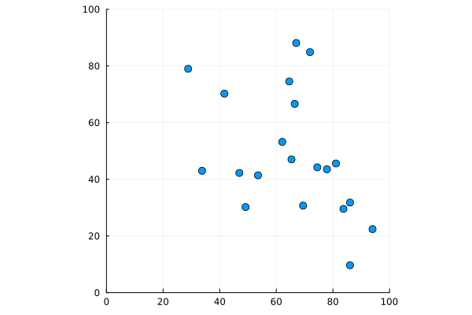

# Particles Simulation

## How to run
> [!IMPORTANT]
> You need to have Julia already installed in your system.
>
> See [Julia Language official docs](julialang.org)

1. Clone this repository.
2. Navigate to the cloned directory.
3. Start the Julia REPL typing `julia` and pressing enter.
4. Activate the project environment with the following command:
```bash
julia> activate .
```
5. Install the required packages with the following commands:
```bash
julia> ]
(particles) pkg> instantiate
```
(To escape Pkg mode press Ctrl+C)
5. Run the program with the following command:
```bash
julia> include("src/main.jl")
```
- You should see the following output:
```
Simulation complete ✅.
Check the generated GIF file 📹.
```

## How to visualize
The simulation generates a GIF file that can be viewed in any GIF viewer.

# Example


# License
This project is licensed under the Apache 2.0 License - see the [LICENSE](LICENSE) file for details.
