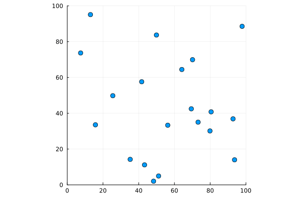

# Particle Simulation
This is a particle simulation written in Julia.

## How to run
1. Clone this repository.
2. Navigate to the cloned directory.
3. Run `julia main.jl`.

## How to visualize
The simulation generates a GIF file that can be viewed in any GIF viewer.

# Example

